# Architecture i18n - Diagrammes

## Vue d'ensemble du système

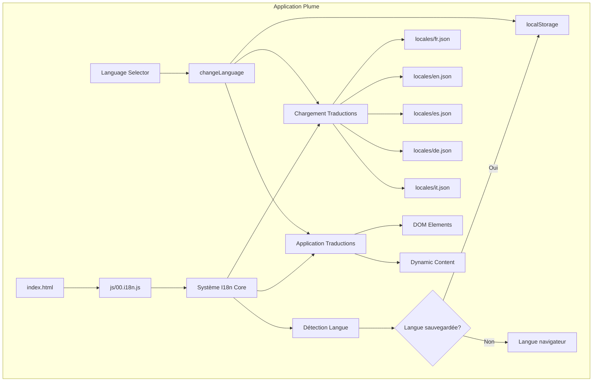

## Structure des fichiers

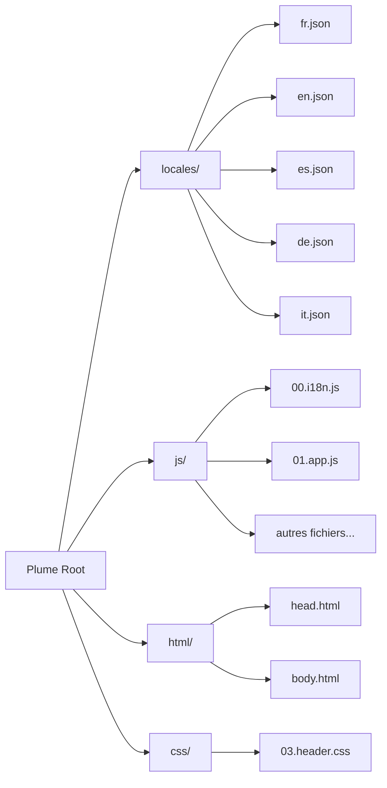

## Flux de traduction

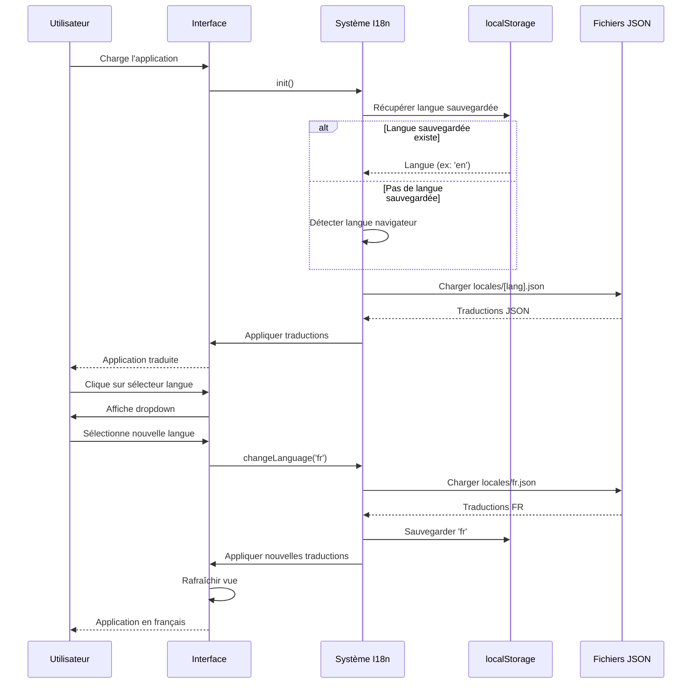

## Hiérarchie des traductions

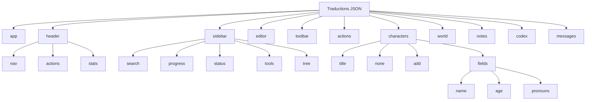

## Composant Language Selector

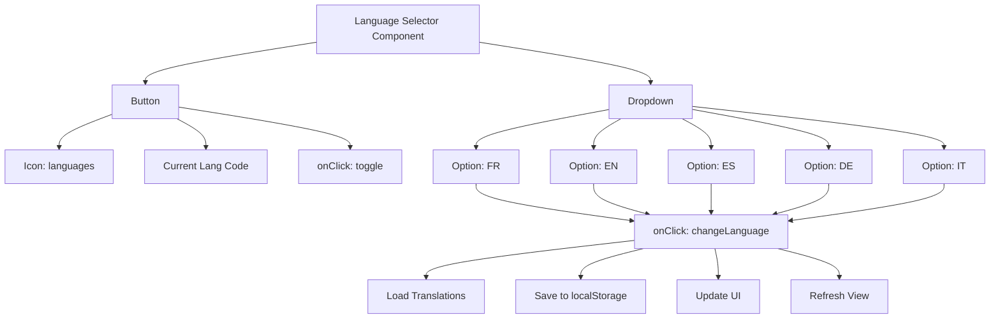

## Intégration dans le Header

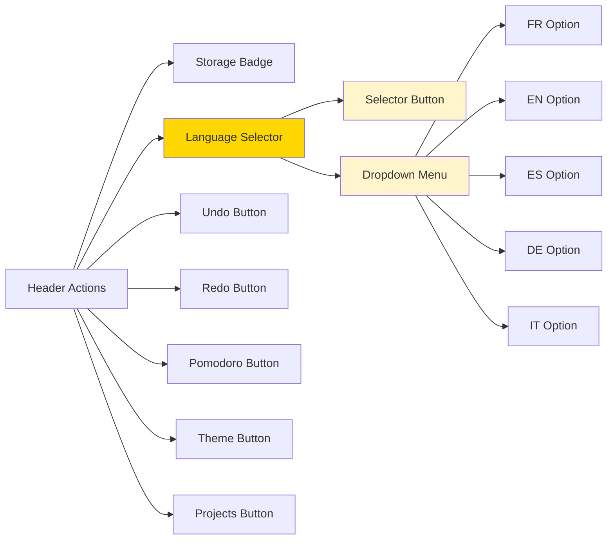

## Processus de migration

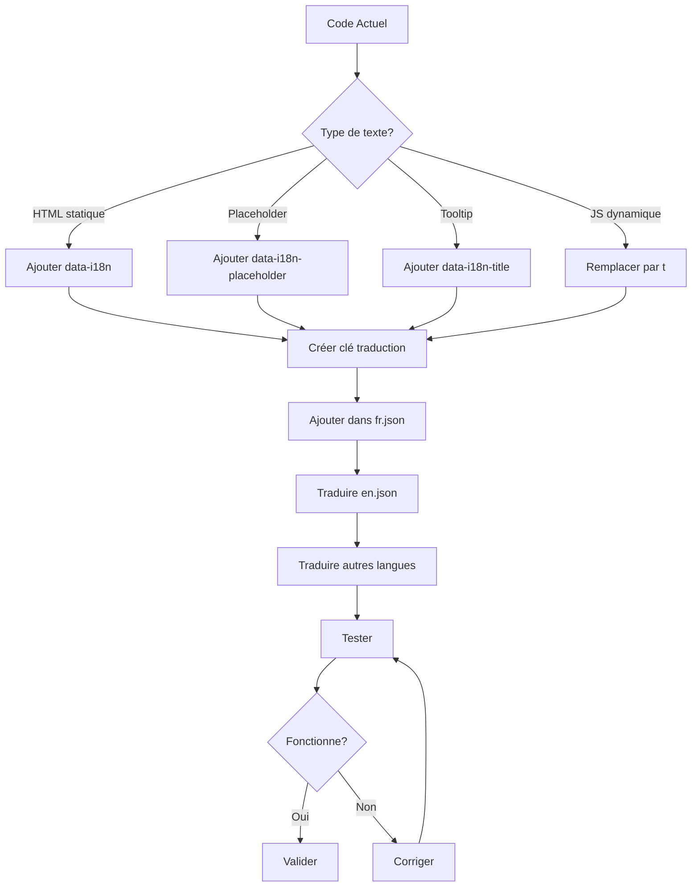

## Exemple de transformation

### Avant
```html
<button onclick="undo()" title="Annuler (Ctrl+Z)">
    <i data-lucide="undo-2"></i>
</button>
```

### Après
```html
<button onclick="undo()" data-i18n-title="header.actions.undoTooltip">
    <i data-lucide="undo-2"></i>
</button>
```

### Traduction
```json
{
  "header": {
    "actions": {
      "undoTooltip": "Annuler (Ctrl+Z)"
    }
  }
}
```

## Gestion des paramètres dynamiques

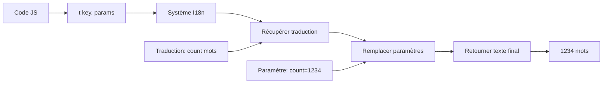

### Exemple
```javascript
// Code
const text = t('header.stats.words', { count: 1234 });

// Traduction FR
"words": "{count} mots"

// Traduction EN
"words": "{count} words"

// Résultat FR: "1234 mots"
// Résultat EN: "1234 words"
```

## États du Language Selector

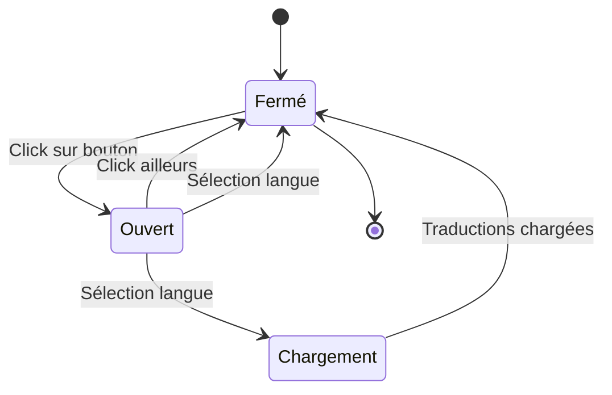

## Performance et Cache

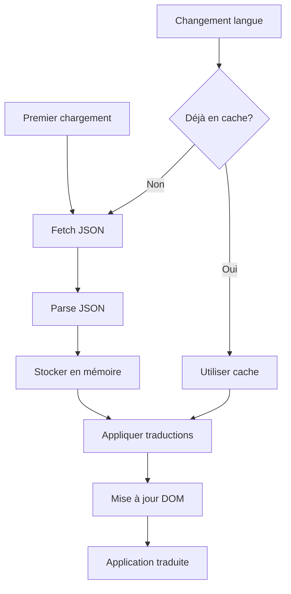

## Compatibilité navigateurs

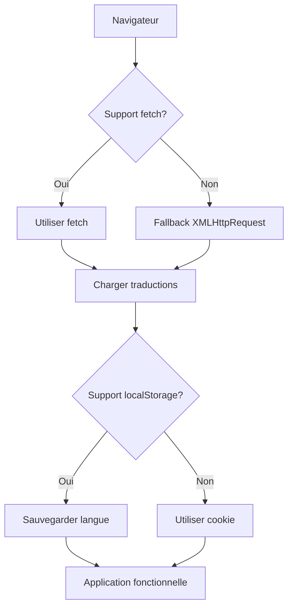
