# Plan d'Implémentation i18n pour Plume

## Vue d'ensemble

Ce document décrit le plan complet pour internationaliser (i18n) l'application Plume, permettant de supporter plusieurs langues avec un sélecteur de langue dans le header.

## Architecture Proposée

### 1. Structure des Fichiers de Traduction

```
locales/
├── fr.json          # Français (langue par défaut actuelle)
├── en.json          # Anglais
├── es.json          # Espagnol
├── de.json          # Allemand
└── it.json          # Italien
```

### 2. Système i18n Core

Créer un nouveau fichier [`js/00.i18n.js`](js/00.i18n.js) qui sera chargé en premier dans le build, contenant:

- **Gestionnaire de traductions**: Charge et gère les fichiers de langue
- **Fonction `t(key, params)`**: Traduit une clé avec support des paramètres
- **Détection de langue**: Détecte la langue du navigateur ou utilise celle sauvegardée
- **Changement de langue**: Permet de changer dynamiquement la langue
- **Persistance**: Sauvegarde la langue choisie dans localStorage

### 3. Format des Clés de Traduction

Structure hiérarchique pour organiser les traductions:

```json
{
  "app": {
    "title": "Plume",
    "subtitle": "Outil d'Écriture"
  },
  "header": {
    "structure": "Structure",
    "corkboard": "Tableau",
    "plot": "Intrigue",
    "characters": "Personnages",
    "world": "Univers",
    "undo": "Annuler",
    "redo": "Rétablir"
  },
  "sidebar": {
    "search": "Rechercher dans tout le projet...",
    "versions": "Versions",
    "annotations": "Annotations",
    "todos": "TODOs"
  },
  "status": {
    "draft": "Brouillon",
    "progress": "En cours",
    "complete": "Terminé",
    "review": "À réviser"
  },
  "actions": {
    "add": "Ajouter",
    "delete": "Supprimer",
    "edit": "Modifier",
    "save": "Enregistrer",
    "cancel": "Annuler",
    "close": "Fermer"
  }
}
```

## Composants à Internationaliser

### Fichiers HTML

#### [`html/head.html`](html/head.html)
- Attribut `lang` de la balise `<html>`
- Balise `<title>`

#### [`html/body.html`](html/body.html)
- Navigation mobile (tous les labels)
- Header principal (tous les boutons de navigation)
- Sidebar (recherche, filtres de statut, outils de scène)
- Tous les placeholders et tooltips

### Fichiers JavaScript (selon [`build.py`](build.py))

Les fichiers suivants contiennent du texte à traduire:

1. **[`js/01.app.js`](js/01.app.js)** - Titre par défaut du projet
2. **[`js/03.project.js`](js/03.project.js)** - Templates de projets, messages d'erreur
3. **[`js/06.structure.js`](js/06.structure.js)** - Labels de structure
4. **[`js/07.stats.js`](js/07.stats.js)** - Statistiques, labels de comptage
5. **[`js/09.floating-editor.js`](js/09.floating-editor.js)** - Menu flottant
6. **[`js/12.import-export.js`](js/12.import-export.js)** - Messages d'import/export
7. **[`js/13.mobile-menu.js`](js/13.mobile-menu.js)** - Menu mobile
8. **[`js/15.characters.js`](js/15.characters.js)** - Fiches personnages
9. **[`js/16.split-view.js`](js/16.split-view.js)** - Vue divisée
10. **[`js/17.world.js`](js/17.world.js)** - Éléments d'univers
11. **[`js/18.timeline.js`](js/18.timeline.js)** - Timeline
12. **[`js/19.notes.js`](js/19.notes.js)** - Notes
13. **[`js/21.sceneVersions.js`](js/21.sceneVersions.js)** - Versions de scènes
14. **[`js/22.diff.js`](js/22.diff.js)** - Comparaison
15. **[`js/23.stats.js`](js/23.stats.js)** - Statistiques détaillées
16. **[`js/24.codex.js`](js/24.codex.js)** - Codex
17. **[`js/25.globalSearch.js`](js/25.globalSearch.js)** - Recherche globale
18. **[`js/28.revision.js`](js/28.revision.js)** - Mode révision
19. **[`js/29.todos.js`](js/29.todos.js)** - TODOs
20. **[`js/30.corkboard.js`](js/30.corkboard.js)** - Tableau de liège
21. **[`js/31.mindmap.js`](js/31.mindmap.js)** - Mindmap
22. **[`js/34.relations-graph.js`](js/34.relations-graph.js)** - Graphe de relations
23. **[`js/36.timeline-metro.js`](js/36.timeline-metro.js)** - Timeline métro
24. **[`js/37.theme-manager.js`](js/37.theme-manager.js)** - Gestionnaire de thèmes
25. **[`js/38.tension.js`](js/38.tension.js)** - Mots de tension
26. **[`js/40.sidebar-views.js`](js/40.sidebar-views.js)** - Vues de la sidebar
27. **[`js/43.arcs.js`](js/43.arcs.js)** - Arcs narratifs
28. **[`js/44.storygrid.js`](js/44.storygrid.js)** - StoryGrid
29. **[`js/45.arc-board.js`](js/45.arc-board.js)** - Tableau d'arcs
30. **[`js/46.thriller-board.js`](js/46.thriller-board.js)** - Tableau thriller

## Composant de Sélection de Langue

### Position dans le Header

Le sélecteur de langue sera placé dans [`html/body.html`](html/body.html) dans la section `header-actions`, juste après le badge de stockage et avant les boutons undo/redo:

```html
<div class="header-actions">
    <!-- Storage badge -->
    <div class="storage-badge-header">...</div>
    
    <!-- NOUVEAU: Language Selector -->
    <div class="language-selector" id="languageSelector">
        <button class="language-selector-btn" onclick="toggleLanguageDropdown()" title="Changer la langue">
            <i data-lucide="languages"></i>
            <span id="currentLanguageCode">FR</span>
        </button>
        <div class="language-dropdown" id="languageDropdown">
            <button class="language-option" data-lang="fr" onclick="changeLanguage('fr')">
                <span class="language-flag">🇫🇷</span>
                <span>Français</span>
            </button>
            <button class="language-option" data-lang="en" onclick="changeLanguage('en')">
                <span class="language-flag">🇬🇧</span>
                <span>English</span>
            </button>
            <button class="language-option" data-lang="es" onclick="changeLanguage('es')">
                <span class="language-flag">🇪🇸</span>
                <span>Español</span>
            </button>
            <button class="language-option" data-lang="de" onclick="changeLanguage('de')">
                <span class="language-flag">🇩🇪</span>
                <span>Deutsch</span>
            </button>
            <button class="language-option" data-lang="it" onclick="changeLanguage('it')">
                <span class="language-flag">🇮🇹</span>
                <span>Italiano</span>
            </button>
        </div>
    </div>
    
    <!-- Undo/Redo buttons -->
    <button class="header-action-btn" onclick="undo()">...</button>
    <button class="header-action-btn" onclick="redo()">...</button>
    ...
</div>
```

### Styles CSS

Ajouter dans [`css/03.header.css`](css/03.header.css):

```css
/* Language Selector */
.language-selector {
    position: relative;
    margin-right: 0.5rem;
}

.language-selector-btn {
    display: flex;
    align-items: center;
    gap: 0.25rem;
    padding: 0.4rem 0.6rem;
    background: var(--bg-secondary);
    border: 1px solid var(--border-color);
    border-radius: 4px;
    color: var(--text-primary);
    cursor: pointer;
    font-size: 0.85rem;
    font-weight: 600;
    transition: all 0.2s ease;
}

.language-selector-btn:hover {
    background: var(--bg-hover);
    border-color: var(--accent-gold);
}

.language-dropdown {
    position: absolute;
    top: calc(100% + 0.5rem);
    right: 0;
    background: var(--bg-primary);
    border: 1px solid var(--border-color);
    border-radius: 6px;
    box-shadow: 0 4px 12px rgba(0, 0, 0, 0.15);
    min-width: 180px;
    z-index: 1000;
    display: none;
    overflow: hidden;
}

.language-dropdown.active {
    display: block;
}

.language-option {
    display: flex;
    align-items: center;
    gap: 0.75rem;
    width: 100%;
    padding: 0.75rem 1rem;
    background: transparent;
    border: none;
    color: var(--text-primary);
    cursor: pointer;
    font-size: 0.9rem;
    text-align: left;
    transition: background 0.2s ease;
}

.language-option:hover {
    background: var(--bg-hover);
}

.language-option.active {
    background: var(--accent-gold);
    color: var(--bg-primary);
    font-weight: 600;
}

.language-flag {
    font-size: 1.2rem;
}
```

## Implémentation Technique

### Étape 1: Créer le système i18n core

```javascript
// js/00.i18n.js
const I18n = {
    currentLanguage: 'fr',
    translations: {},
    fallbackLanguage: 'fr',
    
    async init() {
        // Détecter la langue sauvegardée ou du navigateur
        const savedLang = localStorage.getItem('plume_language');
        const browserLang = navigator.language.split('-')[0];
        this.currentLanguage = savedLang || (this.isSupported(browserLang) ? browserLang : this.fallbackLanguage);
        
        // Charger les traductions
        await this.loadLanguage(this.currentLanguage);
        
        // Appliquer les traductions
        this.applyTranslations();
    },
    
    isSupported(lang) {
        return ['fr', 'en', 'es', 'de', 'it'].includes(lang);
    },
    
    async loadLanguage(lang) {
        try {
            const response = await fetch(`locales/${lang}.json`);
            this.translations = await response.json();
            this.currentLanguage = lang;
            localStorage.setItem('plume_language', lang);
        } catch (error) {
            console.error(`Failed to load language ${lang}`, error);
            if (lang !== this.fallbackLanguage) {
                await this.loadLanguage(this.fallbackLanguage);
            }
        }
    },
    
    t(key, params = {}) {
        const keys = key.split('.');
        let value = this.translations;
        
        for (const k of keys) {
            if (value && typeof value === 'object') {
                value = value[k];
            } else {
                return key; // Retourner la clé si non trouvée
            }
        }
        
        if (typeof value === 'string') {
            // Remplacer les paramètres {param}
            return value.replace(/\{(\w+)\}/g, (match, param) => {
                return params[param] !== undefined ? params[param] : match;
            });
        }
        
        return key;
    },
    
    async changeLanguage(lang) {
        if (this.isSupported(lang) && lang !== this.currentLanguage) {
            await this.loadLanguage(lang);
            this.applyTranslations();
            
            // Mettre à jour l'UI
            this.updateLanguageUI();
            
            // Recharger la vue actuelle
            if (typeof refreshCurrentView === 'function') {
                refreshCurrentView();
            }
        }
    },
    
    applyTranslations() {
        // Traduire tous les éléments avec data-i18n
        document.querySelectorAll('[data-i18n]').forEach(el => {
            const key = el.getAttribute('data-i18n');
            el.textContent = this.t(key);
        });
        
        // Traduire les placeholders
        document.querySelectorAll('[data-i18n-placeholder]').forEach(el => {
            const key = el.getAttribute('data-i18n-placeholder');
            el.placeholder = this.t(key);
        });
        
        // Traduire les titres (tooltips)
        document.querySelectorAll('[data-i18n-title]').forEach(el => {
            const key = el.getAttribute('data-i18n-title');
            el.title = this.t(key);
        });
    },
    
    updateLanguageUI() {
        const codeEl = document.getElementById('currentLanguageCode');
        if (codeEl) {
            codeEl.textContent = this.currentLanguage.toUpperCase();
        }
        
        // Marquer l'option active
        document.querySelectorAll('.language-option').forEach(opt => {
            opt.classList.toggle('active', opt.dataset.lang === this.currentLanguage);
        });
        
        // Mettre à jour l'attribut lang du HTML
        document.documentElement.lang = this.currentLanguage;
    }
};

// Fonction globale pour faciliter l'utilisation
function t(key, params) {
    return I18n.t(key, params);
}

// Fonction pour changer de langue
function changeLanguage(lang) {
    I18n.changeLanguage(lang);
}

// Fonction pour toggle le dropdown
function toggleLanguageDropdown() {
    const dropdown = document.getElementById('languageDropdown');
    dropdown.classList.toggle('active');
}

// Fermer le dropdown si on clique ailleurs
document.addEventListener('click', (e) => {
    const selector = document.getElementById('languageSelector');
    const dropdown = document.getElementById('languageDropdown');
    if (selector && dropdown && !selector.contains(e.target)) {
        dropdown.classList.remove('active');
    }
});
```

### Étape 2: Créer les fichiers de traduction

#### Exemple [`locales/fr.json`](locales/fr.json) (extrait)

```json
{
  "app": {
    "title": "Plume",
    "subtitle": "Outil d'Écriture - Organisation par Chapitres"
  },
  "header": {
    "nav": {
      "structure": "Structure",
      "corkboard": "Tableau",
      "plot": "Intrigue",
      "arcs": "Arcs",
      "thriller": "Thriller",
      "storygrid": "StoryGrid",
      "characters": "Personnages",
      "world": "Univers",
      "codex": "Codex",
      "notes": "Notes",
      "mindmap": "Mindmap",
      "relations": "Relations",
      "map": "Carte",
      "timeline": "Timeline",
      "stats": "Stats",
      "analysis": "Analyse",
      "versions": "Snapshots"
    },
    "actions": {
      "undo": "Annuler",
      "redo": "Rétablir",
      "split": "Split",
      "themes": "Gérer les thèmes",
      "projects": "Gérer les projets",
      "pomodoro": "Timer Pomodoro"
    },
    "stats": {
      "words": "{count} mots",
      "chapters": "{count} chapitres"
    }
  },
  "sidebar": {
    "search": {
      "placeholder": "🔍 Rechercher dans tout le projet..."
    },
    "progress": {
      "scenes": "{count} scènes"
    },
    "status": {
      "draft": "Brouillon",
      "progress": "En cours",
      "complete": "Terminé",
      "review": "À réviser"
    },
    "tools": {
      "versions": "Versions",
      "annotations": "Annotations",
      "todos": "TODOs",
      "arcs": "Arcs",
      "plot": "Intrigue"
    },
    "tree": {
      "expand": "Déplier",
      "collapse": "Replier"
    }
  },
  "editor": {
    "placeholder": "Commencez à écrire votre scène...",
    "synopsis": "Ajouter un résumé de la scène...",
    "focus": "Mode Focus"
  },
  "toolbar": {
    "bold": "Gras",
    "italic": "Italique",
    "underline": "Souligné",
    "strikethrough": "Barré",
    "font": "Police de caractères",
    "fontSize": "Taille de police",
    "textColor": "Couleur du texte",
    "bgColor": "Couleur de fond",
    "alignLeft": "Aligner à gauche",
    "alignCenter": "Centrer",
    "alignRight": "Aligner à droite",
    "justify": "Justifier",
    "heading1": "Titre 1",
    "heading2": "Titre 2",
    "heading3": "Titre 3",
    "paragraph": "Paragraphe",
    "bulletList": "Liste à puces",
    "numberedList": "Liste numérotée",
    "quote": "Citation",
    "indent": "Augmenter l'indentation",
    "outdent": "Diminuer l'indentation",
    "superscript": "Exposant",
    "subscript": "Indice",
    "horizontalRule": "Ligne horizontale",
    "removeFormat": "Supprimer le formatage",
    "revision": "Mode Révision"
  },
  "actions": {
    "add": "Ajouter",
    "delete": "Supprimer",
    "edit": "Modifier",
    "rename": "Renommer",
    "save": "Enregistrer",
    "cancel": "Annuler",
    "close": "Fermer",
    "confirm": "Confirmer",
    "duplicate": "Dupliquer",
    "export": "Exporter",
    "import": "Importer"
  },
  "characters": {
    "title": "Personnages",
    "none": "Aucun personnage",
    "add": "Ajouter un personnage",
    "fields": {
      "name": "Nom",
      "pronouns": "Pronoms",
      "age": "Âge",
      "race": "Race/Espèce",
      "birthDate": "Date de naissance",
      "height": "Taille",
      "weight": "Poids",
      "past": "Passé",
      "present": "Présent",
      "future": "Futur",
      "notes": "Notes diverses"
    }
  },
  "world": {
    "title": "Univers",
    "none": "Aucun élément",
    "add": "Ajouter un élément"
  },
  "notes": {
    "title": "Notes",
    "none": "Aucune note",
    "add": "Ajouter une note"
  },
  "codex": {
    "title": "Codex",
    "none": "Aucune entrée",
    "add": "Ajouter une entrée"
  },
  "messages": {
    "noResults": "Aucun résultat trouvé",
    "noContent": "Aucun contenu",
    "loading": "Chargement...",
    "saved": "Enregistré",
    "error": "Erreur"
  }
}
```

#### Exemple [`locales/en.json`](locales/en.json) (extrait)

```json
{
  "app": {
    "title": "Plume",
    "subtitle": "Writing Tool - Chapter Organization"
  },
  "header": {
    "nav": {
      "structure": "Structure",
      "corkboard": "Corkboard",
      "plot": "Plot",
      "arcs": "Arcs",
      "thriller": "Thriller",
      "storygrid": "StoryGrid",
      "characters": "Characters",
      "world": "World",
      "codex": "Codex",
      "notes": "Notes",
      "mindmap": "Mindmap",
      "relations": "Relations",
      "map": "Map",
      "timeline": "Timeline",
      "stats": "Stats",
      "analysis": "Analysis",
      "versions": "Snapshots"
    },
    "actions": {
      "undo": "Undo",
      "redo": "Redo",
      "split": "Split",
      "themes": "Manage themes",
      "projects": "Manage projects",
      "pomodoro": "Pomodoro Timer"
    },
    "stats": {
      "words": "{count} words",
      "chapters": "{count} chapters"
    }
  },
  "sidebar": {
    "search": {
      "placeholder": "🔍 Search in all project..."
    },
    "progress": {
      "scenes": "{count} scenes"
    },
    "status": {
      "draft": "Draft",
      "progress": "In Progress",
      "complete": "Complete",
      "review": "To Review"
    },
    "tools": {
      "versions": "Versions",
      "annotations": "Annotations",
      "todos": "TODOs",
      "arcs": "Arcs",
      "plot": "Plot"
    },
    "tree": {
      "expand": "Expand",
      "collapse": "Collapse"
    }
  },
  "editor": {
    "placeholder": "Start writing your scene...",
    "synopsis": "Add a scene summary...",
    "focus": "Focus Mode"
  },
  "toolbar": {
    "bold": "Bold",
    "italic": "Italic",
    "underline": "Underline",
    "strikethrough": "Strikethrough",
    "font": "Font",
    "fontSize": "Font Size",
    "textColor": "Text Color",
    "bgColor": "Background Color",
    "alignLeft": "Align Left",
    "alignCenter": "Center",
    "alignRight": "Align Right",
    "justify": "Justify",
    "heading1": "Heading 1",
    "heading2": "Heading 2",
    "heading3": "Heading 3",
    "paragraph": "Paragraph",
    "bulletList": "Bullet List",
    "numberedList": "Numbered List",
    "quote": "Quote",
    "indent": "Increase Indent",
    "outdent": "Decrease Indent",
    "superscript": "Superscript",
    "subscript": "Subscript",
    "horizontalRule": "Horizontal Rule",
    "removeFormat": "Remove Format",
    "revision": "Revision Mode"
  },
  "actions": {
    "add": "Add",
    "delete": "Delete",
    "edit": "Edit",
    "rename": "Rename",
    "save": "Save",
    "cancel": "Cancel",
    "close": "Close",
    "confirm": "Confirm",
    "duplicate": "Duplicate",
    "export": "Export",
    "import": "Import"
  },
  "characters": {
    "title": "Characters",
    "none": "No characters",
    "add": "Add character",
    "fields": {
      "name": "Name",
      "pronouns": "Pronouns",
      "age": "Age",
      "race": "Race/Species",
      "birthDate": "Birth Date",
      "height": "Height",
      "weight": "Weight",
      "past": "Past",
      "present": "Present",
      "future": "Future",
      "notes": "Miscellaneous notes"
    }
  },
  "world": {
    "title": "World",
    "none": "No elements",
    "add": "Add element"
  },
  "notes": {
    "title": "Notes",
    "none": "No notes",
    "add": "Add note"
  },
  "codex": {
    "title": "Codex",
    "none": "No entries",
    "add": "Add entry"
  },
  "messages": {
    "noResults": "No results found",
    "noContent": "No content",
    "loading": "Loading...",
    "saved": "Saved",
    "error": "Error"
  }
}
```

### Étape 3: Modifier le build.py

Mettre à jour [`build.py`](build.py) pour inclure [`js/00.i18n.js`](js/00.i18n.js) en premier:

```python
JS_ORDER = [
    '00.i18n.js',      # NOUVEAU: Système i18n en premier
    '01.app.js',
    '02.storage.js',
    # ... reste inchangé
]
```

### Étape 4: Intégrer les fichiers de traduction dans le build

Deux options:

**Option A: Fichiers externes** (recommandé pour le développement)
- Les fichiers JSON restent séparés dans le dossier `locales/`
- Chargés dynamiquement via fetch

**Option B: Intégration dans le build**
- Créer un script Python pour intégrer les traductions dans le HTML
- Ajouter une balise `<script>` avec les traductions en JSON

## Diagramme de Flux

```mermaid
graph TD
    A[Chargement de l'application] --> B[Initialisation I18n]
    B --> C{Langue sauvegardée?}
    C -->|Oui| D[Charger langue sauvegardée]
    C -->|Non| E{Langue navigateur supportée?}
    E -->|Oui| F[Charger langue navigateur]
    E -->|Non| G[Charger langue par défaut FR]
    D --> H[Appliquer traductions]
    F --> H
    G --> H
    H --> I[Afficher application]
    
    I --> J[Utilisateur clique sur sélecteur]
    J --> K[Afficher dropdown langues]
    K --> L[Utilisateur sélectionne langue]
    L --> M[Charger nouvelles traductions]
    M --> N[Sauvegarder choix localStorage]
    N --> O[Appliquer traductions]
    O --> P[Rafraîchir vue actuelle]
```



## Stratégie de Migration

### Phase 1: Infrastructure (Priorité Haute)
1. Créer le système i18n core ([`js/00.i18n.js`](js/00.i18n.js))
2. Créer les fichiers de traduction de base (FR, EN)
3. Ajouter le sélecteur de langue dans le header
4. Tester le système de base

### Phase 2: HTML (Priorité Haute)
1. Ajouter les attributs `data-i18n`, `data-i18n-placeholder`, `data-i18n-title`
2. Extraire toutes les chaînes de [`html/head.html`](html/head.html)
3. Extraire toutes les chaînes de [`html/body.html`](html/body.html)
4. Tester la navigation et les menus

### Phase 3: JavaScript Core (Priorité Haute)
1. Modifier les fichiers JS principaux pour utiliser `t()`
2. Commencer par les fichiers les plus utilisés:
   - [`js/01.app.js`](js/01.app.js)
   - [`js/03.project.js`](js/03.project.js)
   - [`js/06.structure.js`](js/06.structure.js)
   - [`js/07.stats.js`](js/07.stats.js)

### Phase 4: Fonctionnalités Spécifiques (Priorité Moyenne)
1. Personnages ([`js/15.characters.js`](js/15.characters.js))
2. Univers ([`js/17.world.js`](js/17.world.js))
3. Notes ([`js/19.notes.js`](js/19.notes.js))
4. Codex ([`js/24.codex.js`](js/24.codex.js))

### Phase 5: Visualisations (Priorité Basse)
1. Mindmap ([`js/31.mindmap.js`](js/31.mindmap.js))
2. Timeline ([`js/36.timeline-metro.js`](js/36.timeline-metro.js))
3. StoryGrid ([`js/44.storygrid.js`](js/44.storygrid.js))
4. Thriller Board ([`js/46.thriller-board.js`](js/46.thriller-board.js))

### Phase 6: Langues Supplémentaires (Priorité Basse)
1. Ajouter Espagnol (ES)
2. Ajouter Allemand (DE)
3. Ajouter Italien (IT)

## Considérations Techniques

### Gestion des Dates et Nombres
- Utiliser `Intl.DateTimeFormat` pour les dates
- Utiliser `Intl.NumberFormat` pour les nombres
- Exemple: `new Intl.NumberFormat(I18n.currentLanguage).format(1234)`

### Pluralisation
Ajouter une fonction de pluralisation dans [`js/00.i18n.js`](js/00.i18n.js):

```javascript
plural(key, count, params = {}) {
    const pluralKey = count === 1 ? `${key}.one` : `${key}.other`;
    return this.t(pluralKey, { ...params, count });
}
```

Exemple dans les traductions:
```json
{
  "scenes": {
    "one": "{count} scène",
    "other": "{count} scènes"
  }
}
```

### Performance
- Charger les traductions une seule fois au démarrage
- Mettre en cache les traductions en mémoire
- Éviter les appels répétés à `t()` dans les boucles

### Compatibilité
- Tester sur tous les navigateurs supportés
- Vérifier que les emojis de drapeaux s'affichent correctement
- Prévoir un fallback pour les navigateurs anciens

## Tests à Effectuer

1. **Test de changement de langue**
   - Vérifier que toutes les sections changent de langue
   - Vérifier la persistance après rechargement

2. **Test de détection automatique**
   - Tester avec différentes langues de navigateur
   - Vérifier le fallback vers FR

3. **Test de traductions manquantes**
   - Vérifier que les clés manquantes affichent la clé
   - Pas d'erreurs JavaScript

4. **Test de paramètres**
   - Vérifier les traductions avec paramètres (ex: "{count} mots")
   - Tester la pluralisation

5. **Test d'interface**
   - Vérifier que le dropdown se ferme correctement
   - Vérifier l'indicateur de langue active
   - Tester sur mobile

6. **Test de performance**
   - Mesurer le temps de chargement initial
   - Mesurer le temps de changement de langue
   - Vérifier qu'il n'y a pas de ralentissement

## Documentation pour les Contributeurs

Créer un fichier [`docs/i18n-guide.md`](docs/i18n-guide.md) expliquant:
- Comment ajouter une nouvelle traduction
- Comment ajouter une nouvelle langue
- Conventions de nommage des clés
- Exemples d'utilisation de `t()`

## Estimation des Traductions

Nombre approximatif de chaînes à traduire par catégorie:

- **Navigation et Header**: ~50 chaînes
- **Sidebar et Outils**: ~40 chaînes
- **Éditeur et Toolbar**: ~60 chaînes
- **Personnages**: ~30 chaînes
- **Univers**: ~25 chaînes
- **Notes et Codex**: ~30 chaînes
- **Visualisations**: ~80 chaînes
- **Messages et Actions**: ~50 chaînes
- **Modals et Formulaires**: ~100 chaînes
- **Divers**: ~50 chaînes

**Total estimé: ~515 chaînes à traduire**

## Prochaines Étapes

1. Valider ce plan avec vous
2. Créer la structure de base (i18n.js + fichiers JSON)
3. Implémenter le sélecteur de langue
4. Commencer la migration progressive des fichiers
5. Tester et ajuster

## Questions à Clarifier

1. **Langues prioritaires**: Quelles langues souhaitez-vous en priorité? (FR, EN sont évidents, mais pour ES, DE, IT?)
2. **Fichiers externes vs intégrés**: Préférez-vous garder les traductions dans des fichiers JSON séparés ou les intégrer dans le build?
3. **Traduction des templates de projets**: Faut-il traduire les templates de projets par défaut (Acte I, II, III)?
4. **Traduction des mots de tension**: Les fichiers dans [`mots de tension/`](mots de tension/) doivent-ils être traduits?
5. **Traduction des types thriller**: Les fichiers dans [`thriller/`](thriller/) doivent-ils être traduits?
