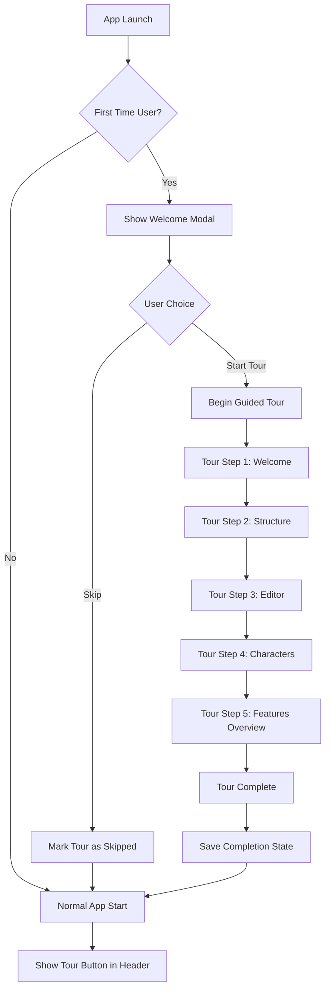

# Product Tour Architecture Plan for Plume

## Executive Summary

This document outlines the architecture and implementation plan for adding an interactive product tour to Plume, a comprehensive writing application. The tour will guide new users through the app's extensive features, improving onboarding and feature discovery.

## 1. Project Overview

### 1.1 Objectives
- Create an intuitive onboarding experience for new users
- Highlight key features across all major sections of the application
- Reduce learning curve and improve user retention
- Provide contextual help without overwhelming users
- Support both guided tours and on-demand feature exploration

### 1.2 Key Features to Showcase

Based on the application structure, the tour should cover:

**Writing Tools (Priority 1)**
- Structure Editor (Acts, Chapters, Scenes)
- Text Editor with formatting tools
- Scene status management
- Split view functionality

**Database Features (Priority 2)**
- Characters management
- World-building (Univers)
- Codex entries
- Notes system

**Visualization Tools (Priority 3)**
- Mindmap
- Relations graph
- Timeline visualization
- Map view

**Planning Tools (Priority 4)**
- Corkboard view
- Plot tracking
- Arcs narratifs
- Thriller board
- StoryGrid

**Utility Features (Priority 5)**
- Statistics and analysis
- Snapshots/versions
- Import/Export
- Theme management
- Pomodoro timer

## 2. Technology Selection

### 2.1 Library Comparison

| Library | Pros | Cons | Recommendation |
|---------|------|------|----------------|
| **Driver.js** | Lightweight (5KB), no dependencies, modern API, highly customizable, MIT license | Newer library, smaller community | ⭐ **RECOMMENDED** |
| **Shepherd.js** | Mature, feature-rich, good documentation, Tether.js integration | Larger size (~20KB), more dependencies | Good alternative |
| **Intro.js** | Very popular, extensive features, good mobile support | Commercial license for some uses, larger size | Consider if budget allows |
| **Custom Solution** | Full control, no dependencies, tailored to needs | Development time, maintenance burden | Not recommended |

### 2.2 Selected Solution: Driver.js

**Rationale:**
- Lightweight and performant
- No external dependencies (fits existing architecture)
- Modern ES6+ API
- Excellent TypeScript support
- Highly customizable styling
- Active maintenance
- MIT license (free for all uses)

**CDN Integration:**
```html
<link rel="stylesheet" href="https://cdn.jsdelivr.net/npm/driver.js@1.3.1/dist/driver.css"/>
<script src="https://cdn.jsdelivr.net/npm/driver.js@1.3.1/dist/driver.iife.js"></script>
```

## 3. Architecture Design

### 3.1 File Structure

```
js/
├── 47.product-tour.js          # Main tour implementation
└── 48.tour-steps.js            # Tour step definitions

css/
└── 14.product-tour.css         # Tour-specific styling

html/
└── head.html                   # Add Driver.js CDN links
```

### 3.2 Tour Flow Design



### 3.3 Tour Stages

**Stage 1: Welcome & Orientation (3 steps)**
1. Welcome message and app overview
2. Header navigation explanation
3. Sidebar structure introduction

**Stage 2: Core Writing Features (5 steps)**
4. Acts, Chapters, Scenes hierarchy
5. Scene editor and formatting tools
6. Scene status management
7. Split view demonstration
8. Auto-save and undo/redo

**Stage 3: Database Features (4 steps)**
9. Characters database
10. World-building (Univers)
11. Notes and Codex
12. Linking elements to scenes

**Stage 4: Visualization Tools (3 steps)**
13. Timeline and relations
14. Mindmap and corkboard
15. Plot tracking tools

**Stage 5: Advanced Features (3 steps)**
16. Statistics and analysis
17. Snapshots and versions
18. Export and backup options

**Stage 6: Completion (1 step)**
19. Tour complete with quick reference guide

## 4. Technical Implementation

### 4.1 State Management

```javascript
// Tour state stored in IndexedDB
const tourState = {
    completed: false,
    skipped: false,
    currentStep: 0,
    lastShown: null,
    version: '1.0',
    preferences: {
        showOnStartup: true,
        autoAdvance: false
    }
};
```

### 4.2 Core Functions

```javascript
// Main tour functions
initProductTour()           // Initialize tour system
startProductTour()          // Begin the tour
resumeProductTour()         // Resume from last step
skipProductTour()           // Skip and mark as completed
resetProductTour()          // Reset tour state
showTourStep(stepId)        // Show specific step
getTourState()              // Get current tour state
saveTourState(state)        // Persist tour state
```

### 4.3 Integration Points

**Initialization (04.init.js)**
```javascript
// Add to init() function
async function init() {
    // ... existing code ...
    
    // Initialize product tour
    await initProductTour();
    
    // Check if first-time user
    const tourState = await getTourState();
    if (!tourState.completed && !tourState.skipped) {
        showWelcomeModal();
    }
}
```

**Header Integration (html/body.html)**
```html
<!-- Add tour button to header actions -->
<button class="header-action-btn" onclick="startProductTour()" 
        title="Démarrer la visite guidée">
    <i data-lucide="help-circle"></i>
</button>
```

### 4.4 Step Definition Structure

```javascript
const tourSteps = [
    {
        element: '#headerProjectTitle',
        popover: {
            title: 'Bienvenue dans Plume',
            description: 'Plume est votre compagnon d\'écriture complet...',
            side: 'bottom',
            align: 'start'
        },
        onNext: () => {
            // Custom action before moving to next step
        }
    },
    // ... more steps
];
```

## 5. User Experience Design

### 5.1 Welcome Modal

```
┌─────────────────────────────────────────┐
│  🪶 Bienvenue dans Plume                │
│                                         │
│  Plume est votre espace d'écriture     │
│  complet pour créer des histoires      │
│  captivantes.                          │
│                                         │
│  Voulez-vous découvrir les             │
│  fonctionnalités principales ?         │
│                                         │
│  [Commencer la visite] [Plus tard]     │
│                                         │
│  ☐ Ne plus afficher ce message         │
└─────────────────────────────────────────┘
```

### 5.2 Tour Controls

Each tour step includes:
- **Progress indicator**: "Étape 3/19"
- **Navigation buttons**: "Précédent", "Suivant", "Terminer"
- **Skip option**: "Passer la visite"
- **Close button**: "×"

### 5.3 Highlight Styles

```css
/* Highlighted element */
.driver-active-element {
    outline: 3px solid var(--primary-color);
    outline-offset: 4px;
    border-radius: 8px;
}

/* Popover styling */
.driver-popover {
    background: var(--bg-primary);
    border: 1px solid var(--border-color);
    border-radius: 12px;
    box-shadow: 0 8px 24px rgba(0,0,0,0.15);
}
```

## 6. Responsive Design

### 6.1 Desktop Experience (> 1024px)
- Full tour with all steps
- Side-by-side popovers
- Detailed descriptions

### 6.2 Tablet Experience (768px - 1024px)
- Condensed tour steps
- Bottom-aligned popovers
- Shorter descriptions

### 6.3 Mobile Experience (< 768px)
- Simplified tour (10 key steps)
- Full-screen modal approach
- Swipe navigation
- Focus on essential features only

## 7. Accessibility Features

### 7.1 Keyboard Navigation
- `Tab`: Navigate between tour controls
- `Enter/Space`: Activate buttons
- `Esc`: Close/skip tour
- `Arrow keys`: Previous/Next step

### 7.2 Screen Reader Support
- ARIA labels for all tour elements
- Announce step changes
- Describe highlighted elements
- Provide alternative text for icons

### 7.3 Focus Management
- Trap focus within tour popover
- Restore focus after tour completion
- Clear focus indicators

## 8. Performance Considerations

### 8.1 Lazy Loading
- Load Driver.js only when needed
- Defer tour initialization until after app load
- Preload tour steps asynchronously

### 8.2 Optimization
- Minimize DOM queries
- Cache element references
- Use event delegation
- Debounce resize handlers

### 8.3 Bundle Size Impact
- Driver.js: ~5KB gzipped
- Tour configuration: ~3KB
- Custom CSS: ~2KB
- **Total addition: ~10KB**

## 9. Testing Strategy

### 9.1 Functional Testing
- [ ] Tour starts correctly for first-time users
- [ ] All steps display properly
- [ ] Navigation works (next, previous, skip)
- [ ] Tour state persists correctly
- [ ] Tour can be restarted
- [ ] Tour adapts to different views

### 9.2 Cross-Browser Testing
- [ ] Chrome/Edge (Chromium)
- [ ] Firefox
- [ ] Safari
- [ ] Mobile browsers (iOS Safari, Chrome Mobile)

### 9.3 Responsive Testing
- [ ] Desktop (1920x1080, 1366x768)
- [ ] Tablet (iPad, Android tablets)
- [ ] Mobile (iPhone, Android phones)
- [ ] Different orientations

### 9.4 Accessibility Testing
- [ ] Keyboard navigation
- [ ] Screen reader compatibility (NVDA, JAWS, VoiceOver)
- [ ] Color contrast ratios
- [ ] Focus indicators

## 10. Maintenance & Updates

### 10.1 Version Management
- Track tour version in state
- Migrate users to new tour versions
- Show "What's New" for returning users

### 10.2 Analytics (Optional)
- Track tour completion rate
- Identify drop-off points
- Measure feature discovery
- A/B test different tour flows

### 10.3 Content Updates
- Keep tour content in sync with app changes
- Update screenshots/descriptions
- Add new features to tour
- Remove deprecated features

## 11. Implementation Phases

### Phase 1: Foundation (Core Implementation)
1. Add Driver.js to project
2. Create basic tour infrastructure
3. Implement state management
4. Add welcome modal
5. Create first 5 tour steps

### Phase 2: Content Development
6. Define all tour steps
7. Write descriptions and titles
8. Add custom styling
9. Implement step-specific actions
10. Add progress tracking

### Phase 3: Polish & Integration
11. Add keyboard navigation
12. Implement responsive behavior
13. Add accessibility features
14. Create tour restart functionality
15. Add header tour button

### Phase 4: Testing & Refinement
16. Cross-browser testing
17. Responsive testing
18. Accessibility audit
19. User feedback collection
20. Performance optimization

## 12. Success Metrics

### 12.1 Quantitative Metrics
- Tour completion rate > 60%
- Average time to complete: 3-5 minutes
- Feature discovery rate increase: +40%
- User retention (Day 7): +25%

### 12.2 Qualitative Metrics
- User feedback on tour helpfulness
- Reduction in support questions
- Improved user confidence
- Positive onboarding experience

## 13. Future Enhancements

### 13.1 Contextual Tours
- Feature-specific mini-tours
- "What's This?" tooltips
- Interactive help system

### 13.2 Personalization
- Role-based tours (novelist, screenwriter, etc.)
- Adaptive tour based on user behavior
- Skip familiar features

### 13.3 Gamification
- Achievement badges
- Progress rewards
- Feature mastery tracking

## 14. Risk Assessment

| Risk | Impact | Probability | Mitigation |
|------|--------|-------------|------------|
| Tour feels overwhelming | High | Medium | Break into smaller segments, allow skipping |
| Performance impact | Medium | Low | Lazy load, optimize code |
| Maintenance burden | Medium | Medium | Modular design, clear documentation |
| Browser compatibility | Low | Low | Use well-tested library, fallbacks |
| Accessibility issues | High | Low | Follow WCAG guidelines, test thoroughly |

## 15. Dependencies

### 15.1 External Dependencies
- Driver.js (v1.3.1+)
- Lucide icons (already in project)

### 15.2 Internal Dependencies
- IndexedDB (02.storage.js)
- Modal system (existing)
- View switching (03.project.js)

### 15.3 Browser Requirements
- Modern browsers with ES6+ support
- IndexedDB support
- CSS Grid and Flexbox support

## 16. Rollout Strategy

### 16.1 Soft Launch
1. Enable for 10% of new users
2. Collect feedback
3. Iterate on content and flow
4. Fix critical issues

### 16.2 Full Launch
1. Enable for all new users
2. Add "Take Tour" button for existing users
3. Monitor completion rates
4. Gather user feedback

### 16.3 Post-Launch
1. Analyze metrics
2. Optimize based on data
3. Add requested features
4. Update content regularly

## 17. Documentation Requirements

### 17.1 Developer Documentation
- Tour architecture overview
- Adding new tour steps
- Customizing tour behavior
- Troubleshooting guide

### 17.2 User Documentation
- How to restart the tour
- How to skip specific sections
- Keyboard shortcuts
- FAQ

## Conclusion

This product tour implementation will significantly improve the onboarding experience for Plume users. By using Driver.js and following best practices for UX, accessibility, and performance, we can create an engaging and helpful tour that showcases the app's powerful features without overwhelming new users.

The modular architecture ensures easy maintenance and updates, while the phased implementation approach allows for iterative improvements based on user feedback.

---

**Document Version**: 1.0  
**Last Updated**: 2026-02-01  
**Author**: Architect Mode  
**Status**: Ready for Review
