# Product Tour Flow Diagrams

## Overview

This document provides visual representations of the product tour flow, user journeys, and system architecture.

## 1. Main Tour Flow

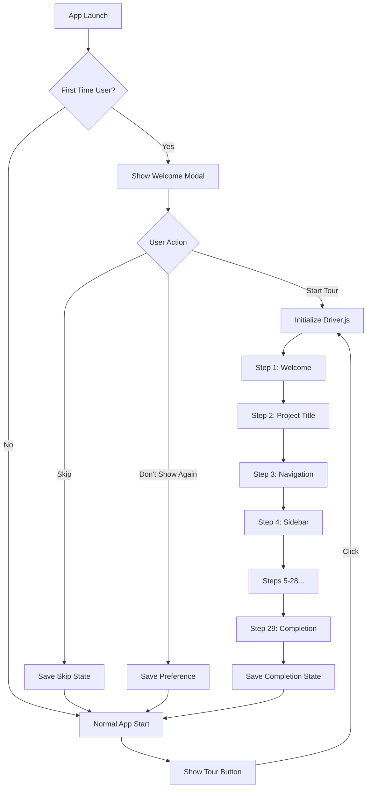

## 2. User Journey Map

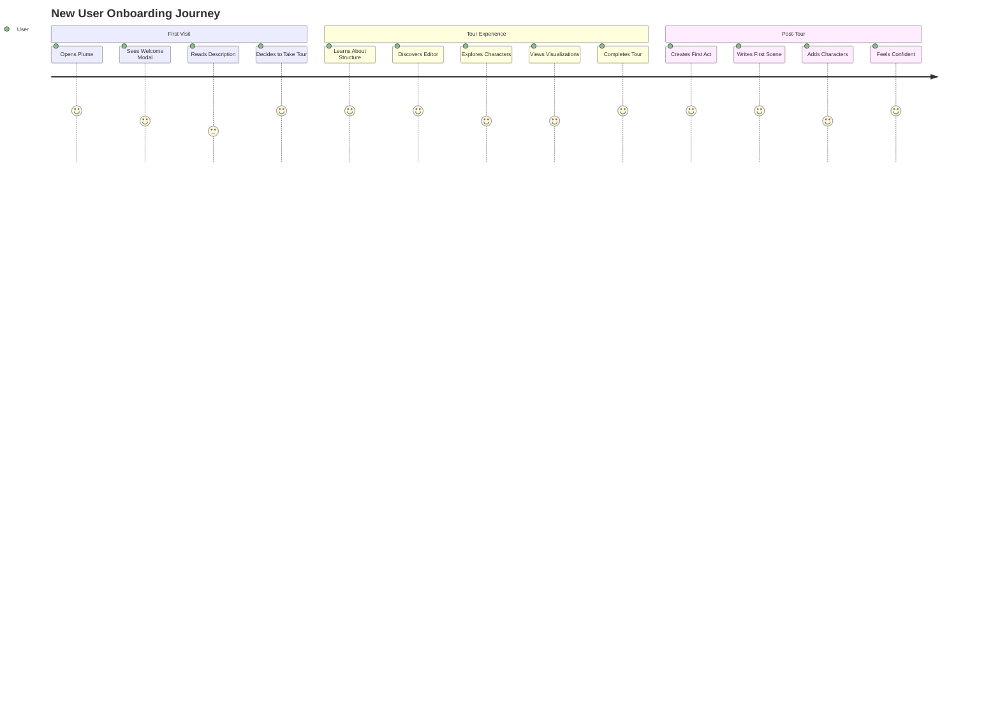

## 3. Tour State Machine

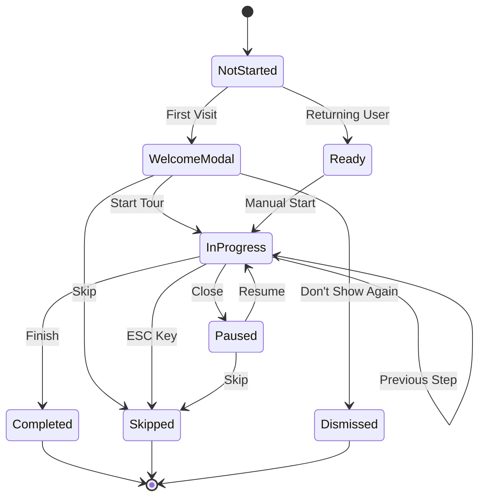

## 4. Component Architecture

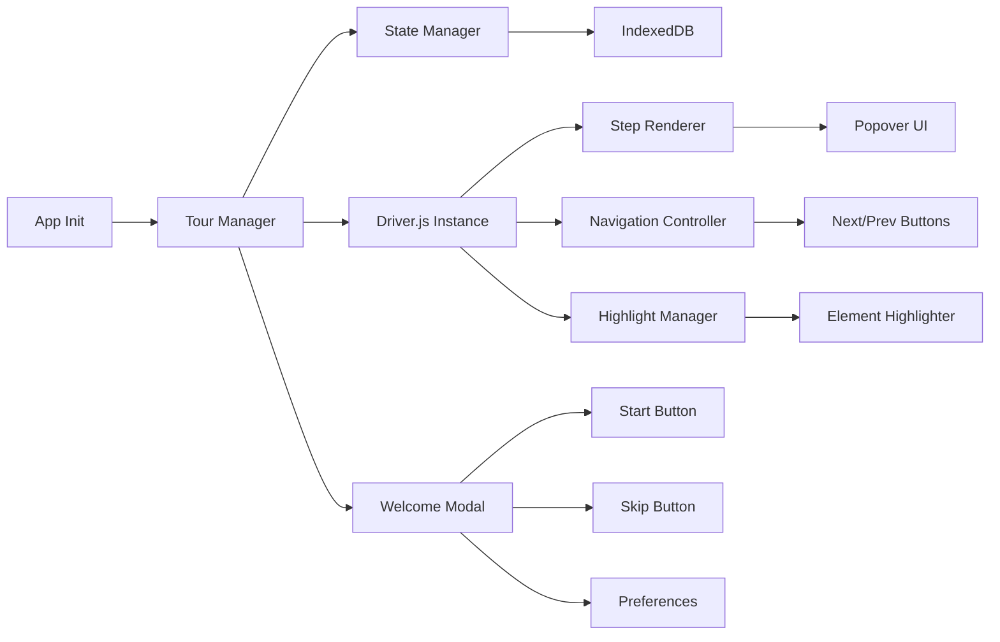

## 5. Tour Steps Hierarchy

```mermaid
graph TD
    A[Product Tour] --> B[Stage 1: Welcome]
    A --> C[Stage 2: Core Features]
    A --> D[Stage 3: Database]
    A --> E[Stage 4: Visualizations]
    A --> F[Stage 5: Advanced]
    A --> G[Stage 6: Completion]
    
    B --> B1[Step 1: Welcome]
    B --> B2[Step 2: Project Title]
    B --> B3[Step 3: Navigation]
    B --> B4[Step 4: Header Actions]
    
    C --> C1[Step 5: Sidebar]
    C --> C2[Step 6: Search]
    C --> C3[Step 7: Progress]
    C --> C4[Step 8-14: Editor Features]
    
    D --> D1[Step 15: Characters Tab]
    D --> D2[Step 16: Character List]
    D --> D3[Step 17: World Tab]
    D --> D4[Step 18: Notes & Codex]
    
    E --> E1[Step 19: Viz Overview]
    E --> E2[Step 20: Corkboard]
    E --> E3[Step 21: Plot]
    E --> E4[Step 22-23: Arcs & Thriller]
    
    F --> F1[Step 24: Statistics]
    F --> F2[Step 25: Analysis]
    F --> F3[Step 26: Snapshots]
    F --> F4[Step 27-28: Storage & Projects]
    
    G --> G1[Step 29: Completion]
```

## 6. Data Flow

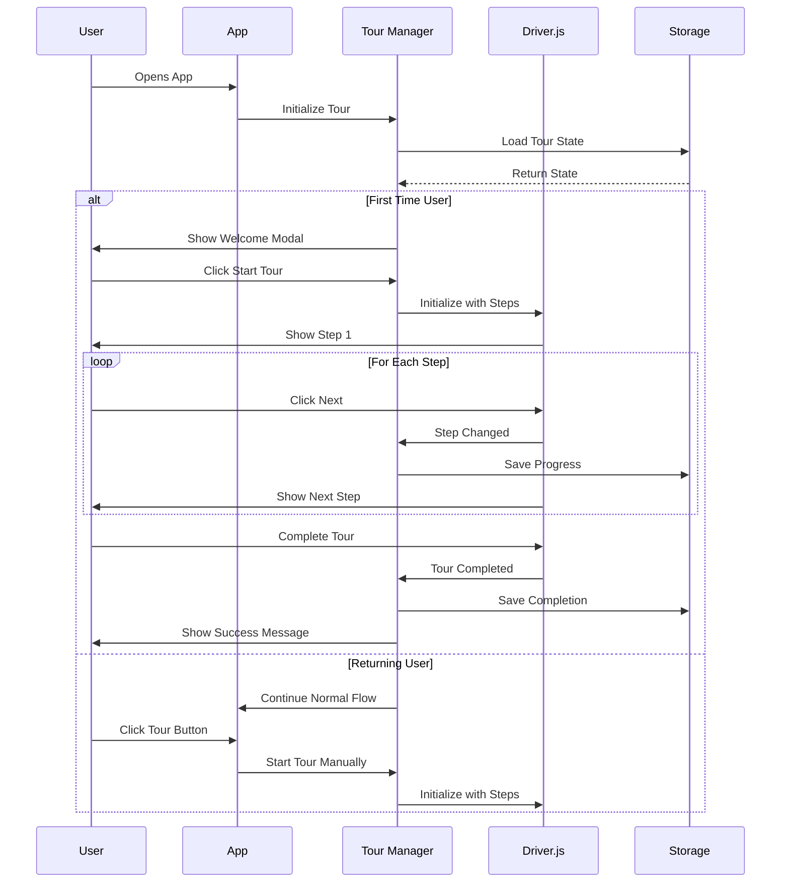

## 7. Responsive Behavior

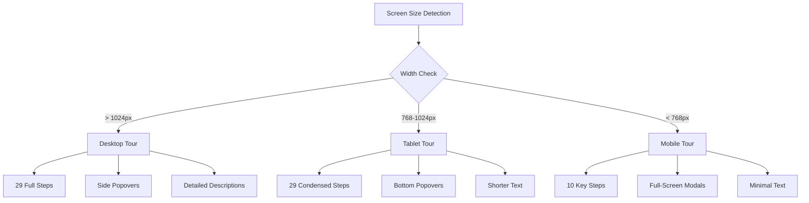

## 8. Integration Points

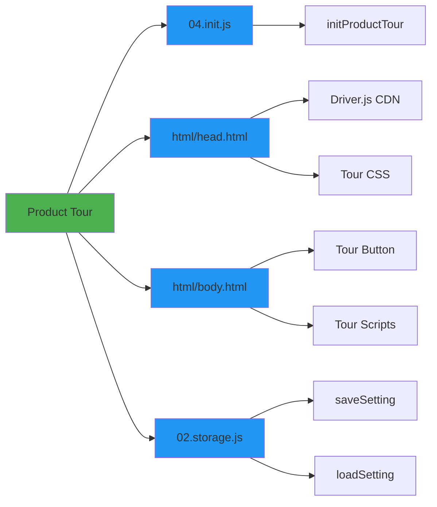

## 9. Event Flow

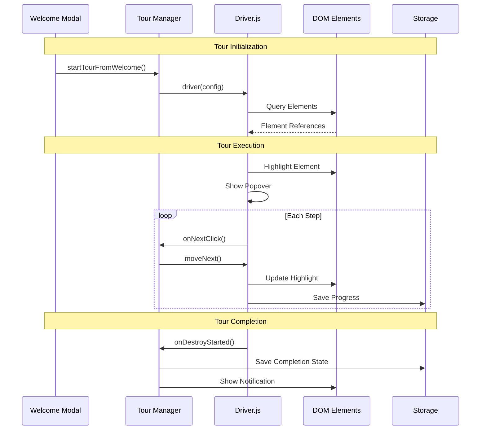

## 10. Error Handling Flow

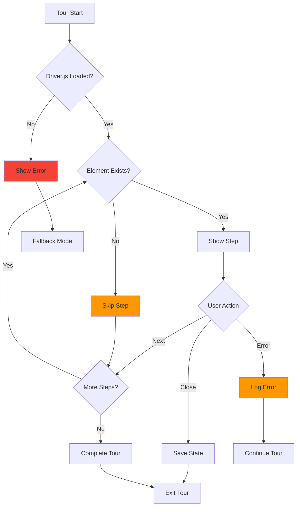

## 11. Mobile Tour Simplified Flow

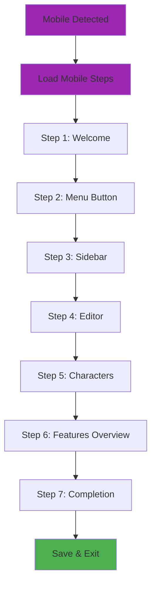

## 12. Accessibility Flow

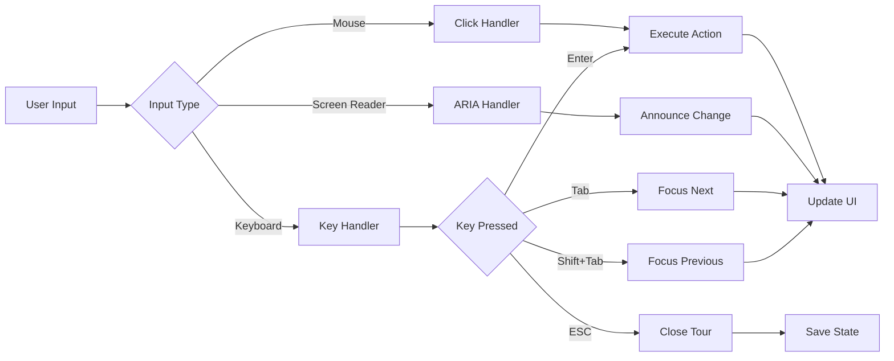

## 13. Performance Optimization

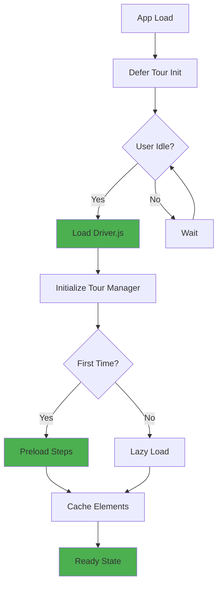

## 14. Testing Flow

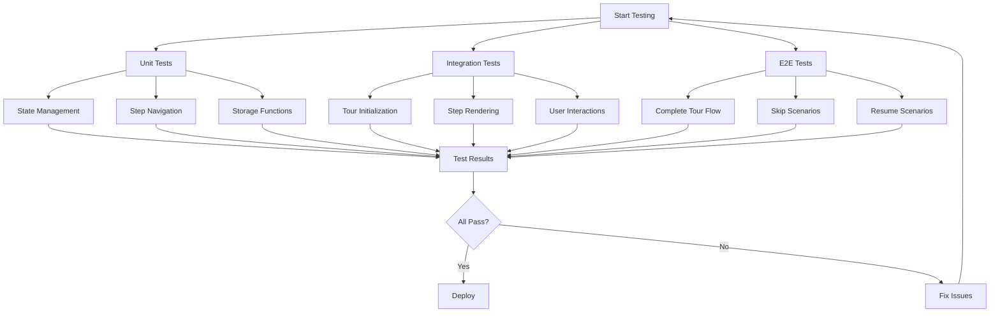

## 15. Deployment Pipeline

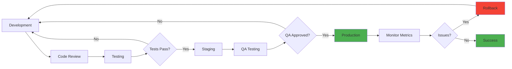

## Legend

### Node Colors
- 🟢 Green: Success/Completion states
- 🔵 Blue: Process/Action nodes
- 🟣 Purple: Mobile-specific
- 🟠 Orange: Warning/Skip states
- 🔴 Red: Error states

### Arrow Types
- Solid: Primary flow
- Dashed: Alternative flow
- Dotted: Error/Exception flow

---

**Document Version**: 1.0  
**Last Updated**: 2026-02-01  
**Status**: Complete
